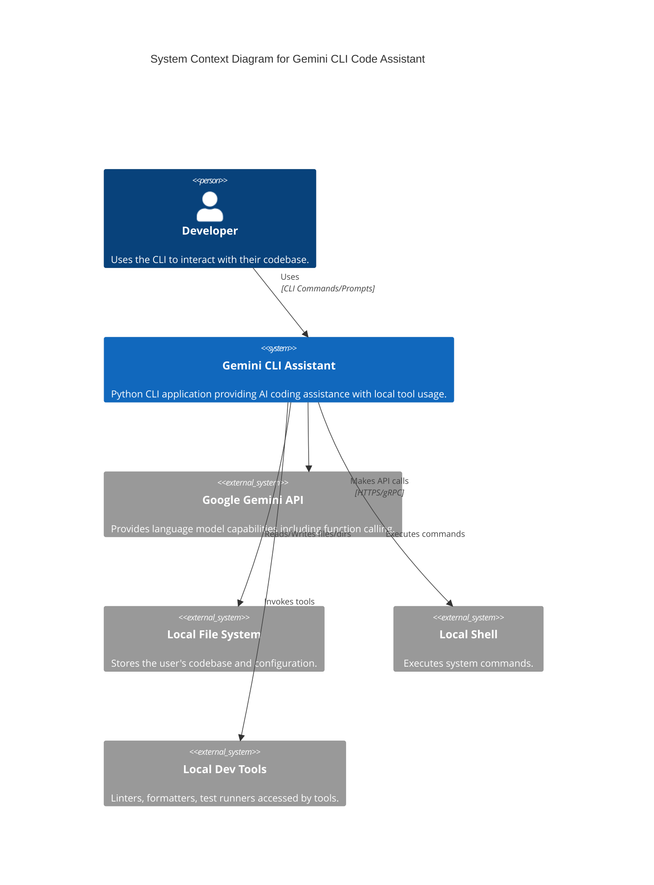

# Gemini CLI Code Assistant - Architecture Analysis

This document outlines the architecture of the `gemini-cli` Python application, a command-line coding assistant powered by Google Gemini models.

## 1. Overview

The application provides an interactive CLI experience where users can converse with a Gemini model. The key feature is the model's ability to use local tools (file system operations, command execution, code analysis) via Gemini's native function calling mechanism to fulfill user requests related to the codebase in the current working directory.

## 2. Core Components

The system is composed of several key Python modules and concepts:

```mermaid
graph TD
    subgraph "User Interaction"
        CLI[CLI (main.py - Click, Rich)]
    end

    subgraph "Application Core"
        Agent[Model Agent (models/gemini.py)]
        Config[Configuration (config.py)]
        Utils[Utilities (utils.py)]
    end

    subgraph "Tools"
        ToolRegistry[Tool Registry (tools/__init__.py)]
        FileTool[File Tools (file_tools.py)]
        DirTool[Directory Tools (directory_tools.py)]
        SystemTool[System Tools (system_tools.py)]
        QualityTool[Quality Tools (quality_tools.py)]
        OtherTools[...]
    end

    subgraph "External Services"
        GeminiAPI[Google Gemini API]
    end

    subgraph "Local System"
        FileSystem[File System]
        Terminal[Shell/Terminal]
        Linters[Linters/Formatters]
    end

    CLI --> Agent
    Agent --> Config
    Agent --> Utils
    Agent --> ToolRegistry
    Agent --> GeminiAPI

    ToolRegistry --> FileTool
    ToolRegistry --> DirTool
    ToolRegistry --> SystemTool
    ToolRegistry --> QualityTool
    ToolRegistry --> OtherTools

    FileTool --> FileSystem
    DirTool --> FileSystem
    SystemTool --> Terminal
    QualityTool --> Linters
    QualityTool --> FileSystem

    Agent -- Function Call Results --> Agent
    GeminiAPI -- Function Calls / Text --> Agent

    click[Click Lib] --> CLI
    rich[Rich Lib] --> CLI
    genai[google-generativeai Lib] --> Agent
    genai --> GeminiAPI
    questionary[Questionary Lib] --> Agent # For confirmations

    style Agent fill:#f9f,stroke:#333,stroke-width:2px
    style CLI fill:#ccf,stroke:#333,stroke-width:2px
    style ToolRegistry fill:#cfc,stroke:#333,stroke-width:1px
    style GeminiAPI fill:#ffc,stroke:#333,stroke-width:1px
    style FileSystem fill:#eee,stroke:#666,stroke-width:1px,stroke-dasharray: 5 5
    style Terminal fill:#eee,stroke:#666,stroke-width:1px,stroke-dasharray: 5 5
    style Linters fill:#eee,stroke:#666,stroke-width:1px,stroke-dasharray: 5 5

```

*   **CLI (`src/gemini_cli/main.py`)**:
    *   **Responsibility**: User entry point, command parsing, session initiation, basic output formatting.
    *   **Technologies**: `click` (CLI framework), `rich` (terminal formatting).
    *   **Interaction**: Takes user commands/input, initializes and invokes the `GeminiModel` agent.
*   **Configuration (`src/gemini_cli/config.py`)**:
    *   **Responsibility**: Loading and saving configuration data (API keys, default model).
    *   **Interaction**: Provides configuration values to the `GeminiModel`.
*   **Model Agent (`src/gemini_cli/models/gemini.py`)**:
    *   **Responsibility**: The core logic engine. Manages interaction with the Gemini API, orchestrates the agentic loop (prompting, function calling, tool execution), maintains conversation history, handles errors, and manages context. Implements the "Human-in-the-Loop" confirmation for sensitive operations.
    *   **Technologies**: `google-generativeai` (Gemini SDK), `questionary` (user confirmations).
    *   **Interaction**: Communicates with the Gemini API, invokes tools via the `ToolRegistry`, receives tool results, formats final output for the `CLI`.
*   **Tool Registry & Tools (`src/gemini_cli/tools/`)**:
    *   **Responsibility**: Defines the capabilities the agent can perform locally. Each tool is a class with an `execute` method and a `get_function_declaration` method to provide its schema to the Gemini API. `__init__.py` acts as a registry.
    *   **Interaction**: The `Agent` requests tool execution via `get_tool()` and `execute()`. Tools interact directly with the `Local System` (File System, Shell, etc.).
*   **Utilities (`src/gemini_cli/utils.py`)**:
    *   **Responsibility**: Common helper functions (e.g., `count_tokens`).
    *   **Interaction**: Used by other components, primarily the `Agent`.
*   **External Services**:
    *   **Google Gemini API**: The LLM service providing text generation and function calling capabilities.
*   **Local System**:
    *   **File System**: Accessed by file/directory tools.
    *   **Shell/Terminal**: Accessed by system tools (e.g., `BashTool`).
    *   **Linters/Formatters**: Accessed by quality tools.

## 3. High-Level Interaction Flow (Agentic Loop)

The primary interaction follows an agentic loop within the `GeminiModel.generate` method:

```mermaid
sequenceDiagram
    participant User
    participant CLI
    participant Agent
    participant GeminiAPI
    participant ToolRegistry
    participant Tool
    participant FileSystem/Shell

    User->>+CLI: Input prompt (e.g., "Refactor main.py")
    CLI->>+Agent: generate(prompt)
    Agent->>+ToolRegistry: Get 'ls' tool
    ToolRegistry->>Agent: ls tool instance
    Agent->>+Tool: execute() [ls]
    Tool->>+FileSystem/Shell: list directory
    FileSystem/Shell-->>-Tool: directory listing
    Tool-->>-Agent: ls result
    Agent->>Agent: Prepare prompt (context + user request)
    Agent->>Agent: Add prompt to history
    loop Agent Loop (Max Iterations)
        Agent->>+GeminiAPI: generate_content(history, tools)
        GeminiAPI-->>-Agent: Response (Text or Function Call)

        alt Function Call Requested
            Agent->>Agent: Parse Function Call (e.g., view('main.py'))
            opt Requires Confirmation (e.g., edit)
                Agent->>+CLI: Display confirmation panel (rich)
                CLI->>+User: Ask for confirmation (questionary)
                User-->>-CLI: Yes/No
                CLI-->>-Agent: Confirmation status
                alt User Rejects
                    Agent->>Agent: Prepare rejection message
                    Agent->>Agent: Add function_response(rejected) to history
                    Agent->>GeminiAPI: generate_content(history, tools)
                    GeminiAPI-->>Agent: Next Response (likely text acknowledging rejection)
                    Note over Agent: Loop continues or potentially ends
                end
            end
            Agent->>+ToolRegistry: Get tool instance ('view')
            ToolRegistry-->>Agent: Tool instance
            Agent->>+Tool: execute(file_path='main.py')
            Tool->>+FileSystem/Shell: Read file content
            FileSystem/Shell-->>-Tool: File content
            Tool-->>-Agent: Tool result (file content)
            Agent->>Agent: Prepare function_response(result)
            Agent->>Agent: Add function_response to history
            opt Task Complete Signal (tool_name == 'task_complete')
                 Agent->>Agent: Mark task completed, store summary
                 break Loop
            end
        else Text Response
            Agent->>Agent: Store text response
            Agent->>Agent: Add text response to history
            Agent->>Agent: Mark task completed (text implies completion)
            break Loop
        end
    end
    Agent->>-CLI: Final Result/Summary (Markdown)
    CLI->>-User: Display result (rich.markdown)

```

1.  **User Input**: User provides a prompt via the CLI.
2.  **Agent Invocation**: CLI calls the `Agent.generate` method.
3.  **Orientation**: Agent *always* runs the `ls` tool first to get current directory context.
4.  **LLM Call**: Agent sends the chat history (including system prompt, orientation context, and user request) and tool definitions to the Gemini API.
5.  **LLM Response**: Gemini API responds with either:
    *   **Text**: A direct answer, plan, or clarification.
    *   **Function Call**: A request to execute one of the defined tools with specific arguments.
6.  **Tool Execution (if Function Call)**:
    *   Agent parses the function call.
    *   **Confirmation**: If the tool is potentially destructive (e.g., `edit`), the Agent uses `rich` and `questionary` via the `CLI` to ask the user for confirmation.
    *   If confirmed (or not needed), the Agent retrieves the appropriate tool instance from the `ToolRegistry`.
    *   Agent calls the tool's `execute` method with the arguments provided by the LLM.
    *   The `Tool` interacts with the local system (files, shell).
    *   The `Tool` returns the result (e.g., file content, command output, success/error message) to the Agent.
    *   Agent packages the result into a `FunctionResponse` and adds it to the chat history.
7.  **Loop Continuation**: The Agent sends the updated history (including the function call and its result) back to the Gemini API (Step 4) for the next instruction.
8.  **Task Completion**: The loop continues until:
    *   The LLM determines the task is complete and calls the `task_complete` function, providing a summary.
    *   The LLM provides a final text response without a function call.
    *   An error occurs.
    *   The maximum iteration limit is reached.
9.  **Final Output**: The Agent returns the final summary or text response to the CLI, which displays it to the user.

## 4. C4 Model Diagrams

### Level 1: System Context



### Level 2: Containers (Key Modules/Libraries)

```mermaid
C4Container
    title Container Diagram for Gemini CLI Code Assistant

    Person(user, "Developer", "Uses the CLI to interact with their codebase.")

    System_Boundary(cli_system, "Gemini CLI Assistant") {
        Container(cli_main, "CLI Frontend", "Python/Click/Rich", "Handles user commands, IO, initializes agent.")
        Container(agent, "Model Agent", "Python/google-generativeai", "Orchestrates LLM interaction, tool calls, history management, confirmations.")
        Container(tools, "Tool Execution Layer", "Python", "Defines and executes local actions (filesystem, shell, linters) based on agent requests.")
        ContainerDb(config, "Configuration", "YAML/File", "Stores API keys and settings.")
    }

    System_Ext(gemini_api, "Google Gemini API", "Provides language model capabilities including function calling.")
    System_Ext(local_fs, "Local File System", "Stores the user's codebase and configuration.")
    System_Ext(local_shell, "Local Shell", "Executes system commands.")
     System_Ext(local_tools, "Local Dev Tools", "Linters, formatters, test runners accessed by tools.")

    Rel(user, cli_main, "Uses", "CLI")
    Rel(cli_main, agent, "Invokes Agent")
    Rel(agent, cli_main, "Returns results/requests confirmation") # Added return/confirmation path

    Rel(agent, gemini_api, "Sends prompts/history, Receives text/function calls", "HTTPS/gRPC")
    Rel(agent, tools, "Requests tool execution")
    Rel(agent, config, "Reads settings")

    Rel(tools, agent, "Returns tool results")
    Rel(tools, local_fs, "Reads/Writes files/dirs")
    Rel(tools, local_shell, "Executes commands")
    Rel(tools, local_tools, "Invokes tools")

    Rel(config, local_fs, "Reads/Writes config file")

    UpdateRelStyle(user, cli_main, $offsetY="-40")
    UpdateRelStyle(agent, gemini_api, $offsetX="40", $offsetY="60")
    UpdateRelStyle(agent, tools, $offsetY="-20")
    UpdateRelStyle(tools, agent, $offsetY="20")
    UpdateRelStyle(tools, local_fs, $offsetY="40")
    UpdateRelStyle(tools, local_shell, $offsetY="40")
    UpdateRelStyle(tools, local_tools, $offsetY="40")
     UpdateRelStyle(config, local_fs, $offsetY="-40", $offsetX="-40")
```

## 5. Key Design Decisions & Patterns

*   **Agentic Architecture**: The core logic resides in the `GeminiModel` agent, which uses the LLM for reasoning and planning, and local tools for execution.
*   **Native Function Calling**: Leverages Gemini's built-in function calling, eliminating the need for complex prompt parsing to detect tool use intentions. Tools define their schemas via `FunctionDeclaration`.
*   **Modular Tools**: Tools are self-contained classes, easy to add or modify. The `tools/__init__.py` registry allows for dynamic discovery.
*   **Explicit System Prompt**: A detailed system prompt guides the LLM's behavior, defining the expected workflow, tool usage rules, and output formatting.
*   **Persistent History**: The conversation history is maintained across turns within a session, providing context to the LLM. Basic turn-count based truncation is used for context management.
*   **Human-in-the-Loop**: User confirmation is required for potentially destructive operations (`edit`, `create_file`), enhancing safety.
*   **Mandatory Orientation**: The agent always performs an initial `ls` to ground its understanding in the current directory state before processing the user's request.
*   **Dedicated Completion Signal**: The `task_complete` tool provides an explicit signal from the LLM that the task is finished, along with a structured summary.
*   **Rich CLI**: `rich` and `questionary` provide a more interactive and user-friendly terminal experience than basic print/input.
*   **Error Handling**: Includes try/except blocks for API calls, tool execution, and configuration loading. Handles specific errors like `ResourceExhausted` (quota) by attempting a fallback model.

## 6. Potential Areas for Improvement

*   **Token-Based Context Management**: The current history truncation is based on turn count. Switching to token counting (`utils.count_tokens`) would be more precise and prevent exceeding model context limits more reliably.
*   **More Sophisticated Planning**: The current planning relies on the LLM following instructions in the system prompt. More complex tasks might benefit from a dedicated planning phase or framework.
*   **Asynchronous Operations**: For long-running tools (e.g., complex tests, builds), asynchronous execution could improve responsiveness.
*   **State Management**: For more complex interactions spanning multiple independent requests, a more robust state management system might be needed beyond chat history.
*   **Testing**: Expanding the test suite (`test_dir`) to cover more agent interactions and tool functionalities.
*   **Tool Schema Validation**: Add validation to ensure tool schemas are correctly defined and compatible with the Gemini API.
*   **Summarizer Tool Integration**: The `SummarizeCodeTool` exists but wasn't explicitly added to `AVAILABLE_TOOLS` in the reviewed `tools/__init__.py`. It requires special instantiation (passing the model instance), which happens in `GeminiModel`, but its registration could be clearer.

This analysis provides a comprehensive overview of the `gemini-cli` architecture based on the provided code. 