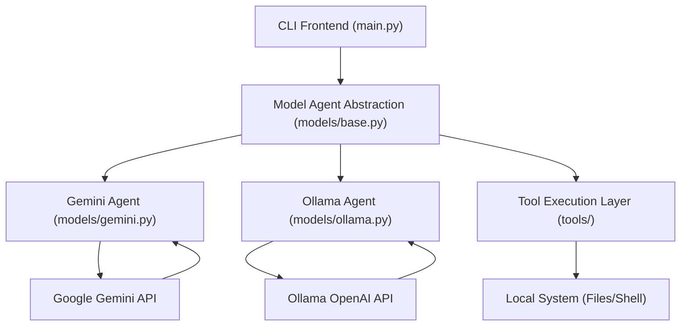
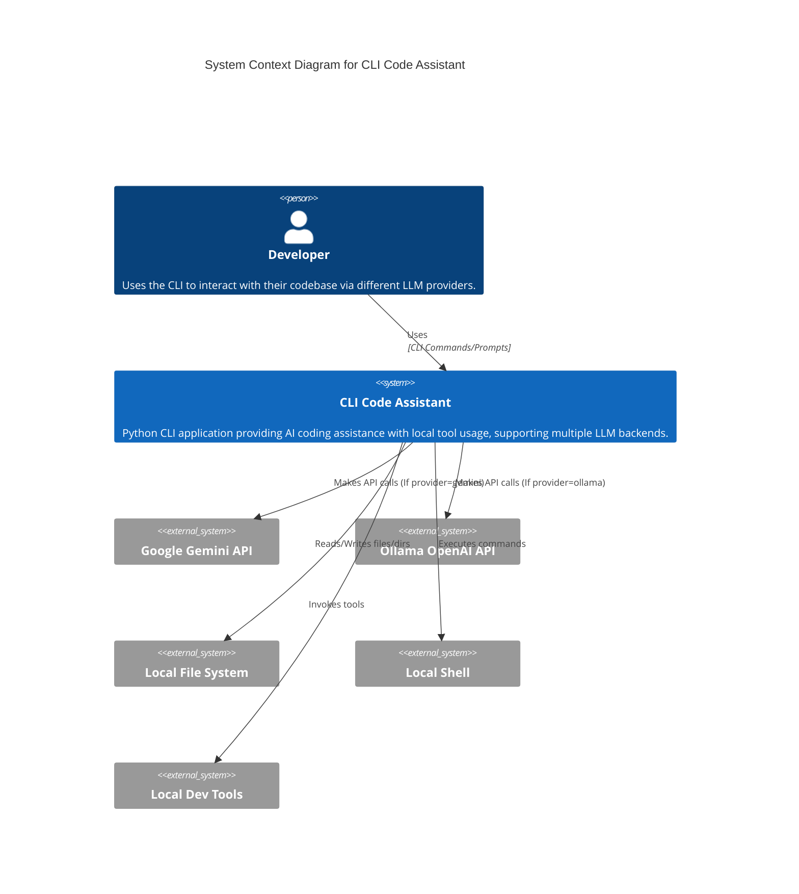
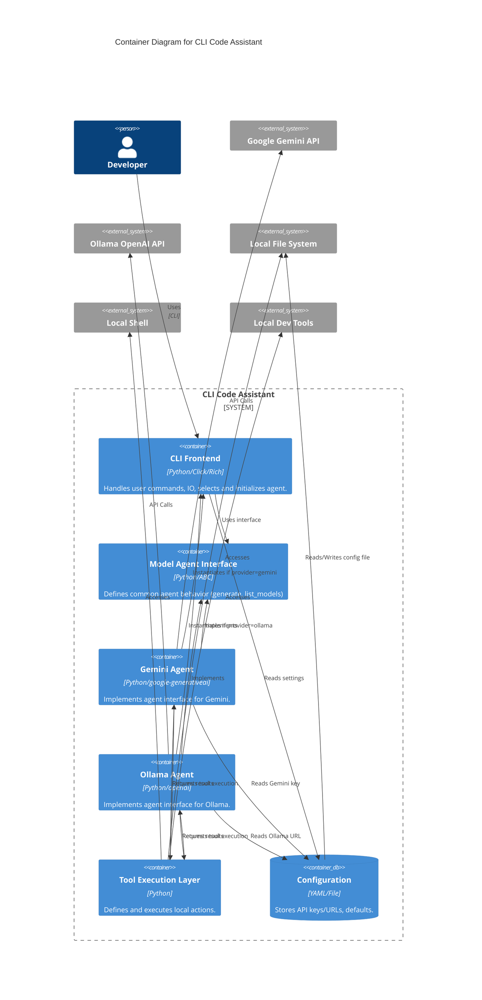
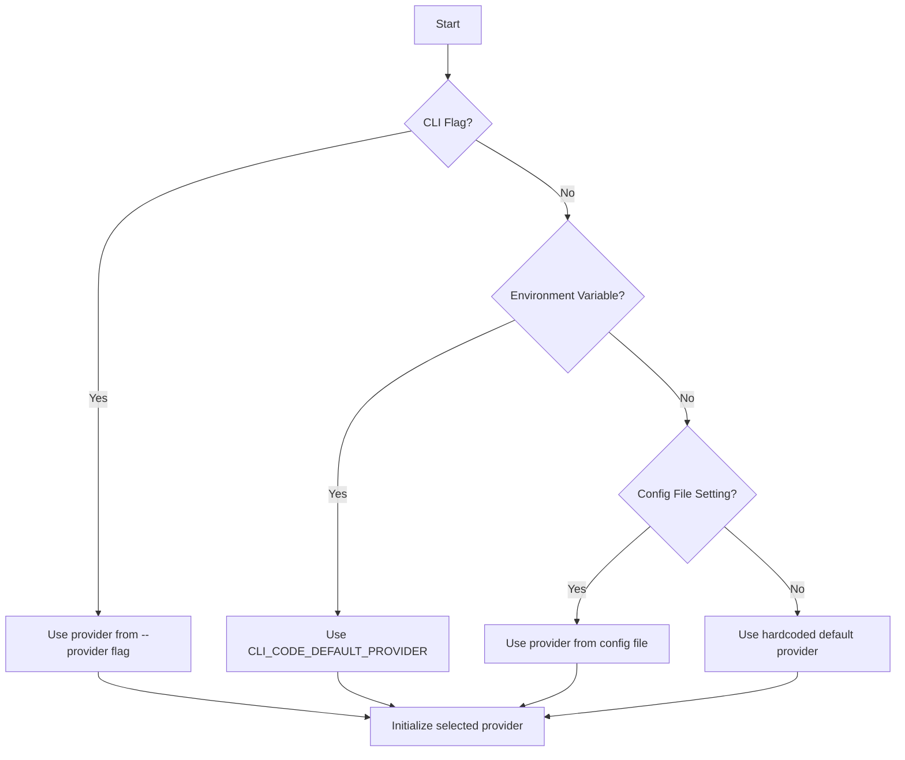
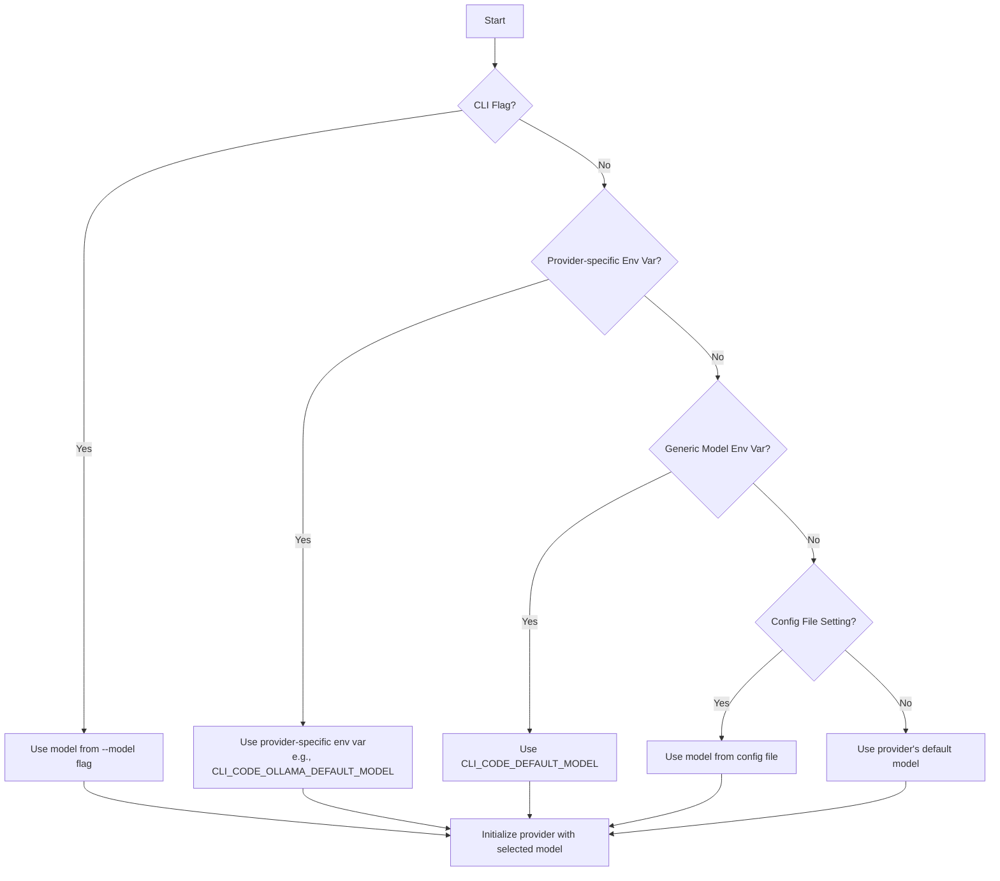

# CLI Code Assistant - Architecture Analysis

This document outlines the architecture of the `cli-code` Python application, a command-line coding assistant powered initially by Google Gemini models, with planned support for other providers like Ollama.

> **Note on Diagrams**: All diagrams in this document follow [GitHub's Mermaid diagram specifications](https://docs.github.com/en/get-started/writing-on-github/working-with-advanced-formatting/creating-diagrams) to ensure proper rendering on GitHub. Please refer to the GitHub documentation when making changes to any diagrams.

## 1. Overview

The application provides an interactive CLI experience where users can converse with a configured LLM (e.g., Gemini). The key feature is the model's ability to use local tools (file system operations, command execution, code analysis) via the provider's function calling mechanism (or equivalent) to fulfill user requests related to the codebase in the current working directory.

## 2. Core Components

The system is composed of several key Python modules and concepts:



*   **CLI (`src/cli_code/main.py`)**:
    *   **Responsibility**: User entry point, command parsing (`--provider`, `--model`), session initiation, basic output formatting. Instantiates the correct agent based on configuration/flags.
    *   **Technologies**: `click`, `rich`.
    *   **Interaction**: Takes user commands/input, initializes and invokes the appropriate `ModelAgent` instance.
*   **Configuration (`src/cli_code/config.py`)**:
    *   **Responsibility**: Loading and saving configuration data (API keys/URLs, default provider, default models).
    *   **Interaction**: Provides configuration values to the `CLI` and `ModelAgent` instances.
*   **Model Agent Abstraction (`src/cli_code/models/base.py`)** (Planned):
    *   **Responsibility**: Defines the common interface (`generate`, `list_models`) for all model provider implementations.
    *   **Interaction**: Serves as the base class for specific provider agents.
*   **Gemini Agent (`src/cli_code/models/gemini.py`)**:
    *   **Responsibility**: Implements the `AbstractModelAgent` interface for Google Gemini. Manages interaction with the Gemini API, orchestrates the agentic loop (prompting, function calling, tool execution), maintains conversation history, handles errors, and manages context. Implements the "Human-in-the-Loop" confirmation.
    *   **Technologies**: `google-generativeai`, `questionary`.
    *   **Interaction**: Communicates with the Gemini API, invokes tools via the `ToolRegistry`, receives tool results, formats final output for the `CLI`.
*   **Ollama Agent (`src/cli_code/models/ollama.py`)** (Planned):
    *   **Responsibility**: Implements the `AbstractModelAgent` interface for Ollama (via OpenAI compatible API). Handles API communication, tool schema translation, agentic loop, history, errors.
    *   **Technologies**: `openai` library, `questionary`.
    *   **Interaction**: Communicates with the Ollama API, invokes tools via the `ToolRegistry`, receives tool results, formats output.
*   **Tool Registry & Tools (`src/cli_code/tools/`)**:
    *   **Responsibility**: Defines the capabilities the agent can perform locally. Each tool provides its schema (adaptable for different providers). `__init__.py` acts as a registry.
    *   **Interaction**: Specific `ModelAgent` requests tool execution. Tools interact directly with the `Local System`.
*   **Utilities (`src/cli_code/utils.py`)**:
    *   **Responsibility**: Common helper functions.
    *   **Interaction**: Used by other components.
*   **External Services**:
    *   **Google Gemini API**: LLM service.
    *   **Ollama OpenAI API**: Alternative LLM service endpoint.
*   **Local System**:
    *   File System, Shell, Linters etc.

## 3. High-Level Interaction Flow (Agentic Loop)

The primary interaction follows an agentic loop within the active `ModelAgent.generate` method:

```mermaid
sequenceDiagram
    participant U as User
    participant C as CLI
    participant A as ActiveAgent
    participant P as ProviderAPI
    participant T as Tools

    U->>C: Input prompt (--provider=ollama)
    C->>A: Create OllamaAgent()
    C->>A: generate(prompt)
    A->>T: Get directory context
    T-->>A: Directory listing

    loop Agent Loop
        A->>P: generate_content() / completions.create()
        P-->>A: Response (Text or Function/Tool Call)

        alt is Function/Tool Call
            A->>A: Parse Call
            opt Requires Confirmation
                 A->>C: Request confirmation
                 C->>U: Ask user
                 U-->>C: Confirmation status
                 C-->>A: Status
                 alt User Rejects
                      A->>A: Handle rejection (inform API)
                      continue Loop
                 end
            end
            A->>T: Execute tool
            T-->>A: Tool result
            A->>A: Update history / Prepare tool response msg
        end
    end

    A->>C: Final Result
    C->>U: Display result
```

1.  **User Input**: User provides a prompt via `cli-code`, potentially with `--provider` and `--model` flags.
2.  **Agent Instantiation**: CLI determines the target provider (flag > config > default) and instantiates the corresponding `ModelAgent` (`GeminiModel` or `OllamaModel`).
3.  **Agent Invocation**: CLI calls the `Agent.generate` method.
4.  **Orientation**: Agent performs initial context gathering (e.g., `ls`).
5.  **LLM Call**: Agent sends the chat history and tool definitions (adapted for the provider's API) to the appropriate API (Gemini or Ollama).
6.  **LLM Response**: API responds with text or a request to call a tool/function.
7.  **Tool Execution (if requested)**:
    *   Agent parses the request.
    *   **Confirmation**: If needed, Agent uses `CLI` to ask the user.
    *   If confirmed/not needed, Agent retrieves the tool from `ToolRegistry`.
    *   Agent calls the tool's `execute` method.
    *   Tool interacts with the local system.
    *   Tool returns result to the Agent.
    *   Agent packages the result into the provider-specific format and adds it to history.
8.  **Loop Continuation**: Agent sends updated history back to the API (Step 5).
9.  **Task Completion**: Loop continues until the task is marked complete by the LLM (e.g., via text response or a dedicated signal like `task_complete`) or limits are reached.
10. **Final Output**: Agent returns the final response to the CLI.

## 4. C4 Model Diagrams

### Level 1: System Context



### Level 2: Containers (Key Modules/Libraries)



## 5. Key Design Decisions & Patterns

*   **Provider Abstraction**: Using `AbstractModelAgent` to allow plugging in different LLM backends.
*   **Agentic Architecture**: The core logic resides in the specific `ModelAgent` implementations.
*   **Native Function/Tool Calling**: Leverages the respective provider's mechanism for tool use.
*   **Modular Tools**: Tools remain independent of the specific LLM provider.
*   **Explicit System Prompt**: Will likely need provider-specific system prompts tailored to their function calling nuances.
*   **Persistent History**: Maintained by the active agent instance.
*   **Human-in-the-Loop**: Confirmation logic remains in the agent, invoked before tool execution.
*   **Configuration Driven**: Provider and model selection controlled by config and CLI flags.
*   **Rich CLI**: `rich` and `questionary` enhance the user experience.
*   **Error Handling**: Needs to be robust within each agent implementation for provider-specific errors.

## 6. Potential Areas for Improvement

*   **Token-Based Context Management**: Implement for both providers.
*   **Sophisticated Planning**: Consider if needed beyond system prompts.
*   **Asynchronous Operations**: Evaluate for long-running tools.
*   **State Management**: Assess if needed for more complex multi-turn tasks.
*   **Testing**: Expand test suite (`test_dir`) to cover both providers, mock API interactions, and test the agent selection logic.
*   **Tool Schema Validation/Translation**: Ensure robust handling of schema differences between Gemini and OpenAI formats.
*   **Summarizer Tool Integration**: Clarify registration/usage.

## 7. Provider and Model Selection Logic

The CLI Code Assistant implements a sophisticated hierarchical resolution system for determining which provider and model to use. This system allows for flexibility in configuration while maintaining sensible defaults.

### Provider Selection

When determining which LLM provider to use, the application follows this precedence order (highest to lowest priority):



1. **Command-line flag**: If the user specifies `--provider=X`, that provider is used.
2. **Environment variable**: If `CLI_CODE_DEFAULT_PROVIDER` is set, that provider is used.
3. **Config file**: If a default provider is set in the configuration file, that provider is used.
4. **Hardcoded default**: If no other selection is found, the application falls back to the hardcoded default (currently "gemini").

### Model Selection

Once a provider is selected, the application determines which model to use for that provider using a similar precedence system:



1. **Command-line flag**: If the user specifies `--model=X`, that model is used.
2. **Provider-specific environment variable**: If a provider-specific environment variable is set (e.g., `CLI_CODE_OLLAMA_DEFAULT_MODEL`), that model is used.
3. **Generic model environment variable**: If `CLI_CODE_DEFAULT_MODEL` is set, that model is used.
4. **Config file**: If a default model is set in the configuration file for the selected provider, that model is used.
5. **Provider default**: If no other selection is found, the provider's default model is used (e.g., "gemini-2.5-pro-exp-03-25" for Gemini).

### Implementation

This logic is primarily implemented in `main.py` when processing CLI arguments and in `config.py` when loading configuration settings and environment variables. The environment variable loading system supports both direct environment variables and loading from a `.env` file, with direct environment variables taking precedence over `.env` file settings.

This hierarchical approach provides a balance between flexibility (users can easily override defaults) and convenience (sensible defaults mean minimal configuration required).

This analysis provides a comprehensive overview of the planned `cli-code` architecture. 