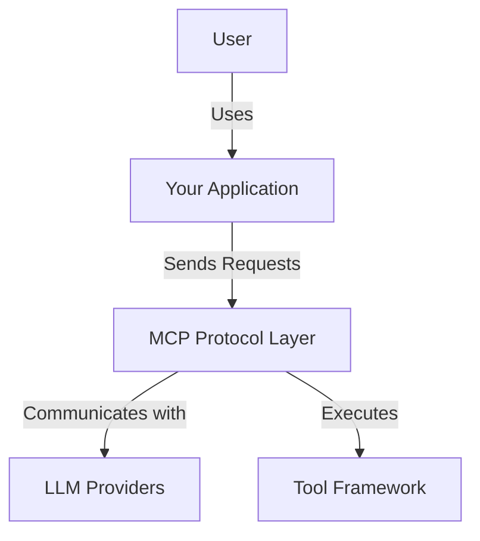
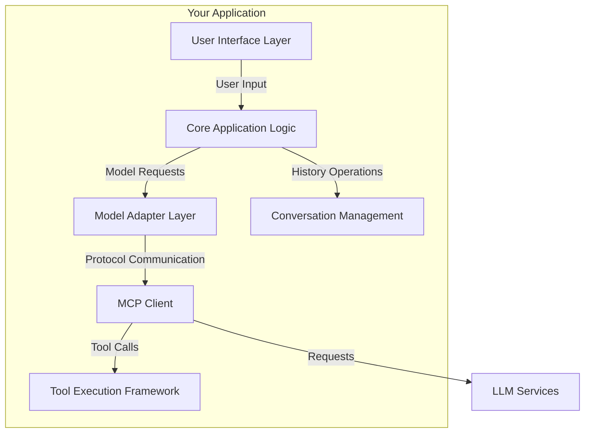
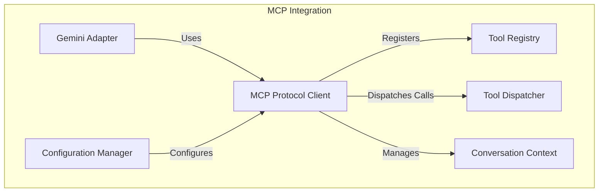
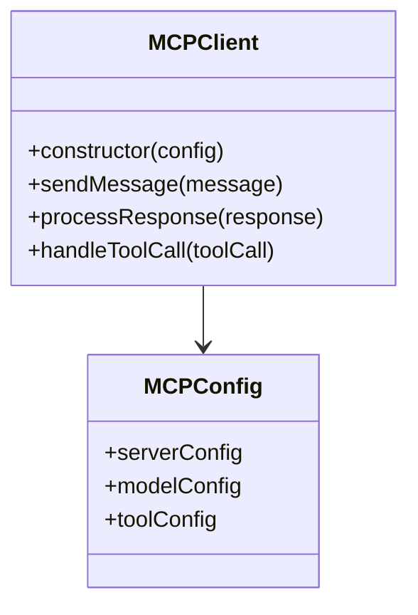
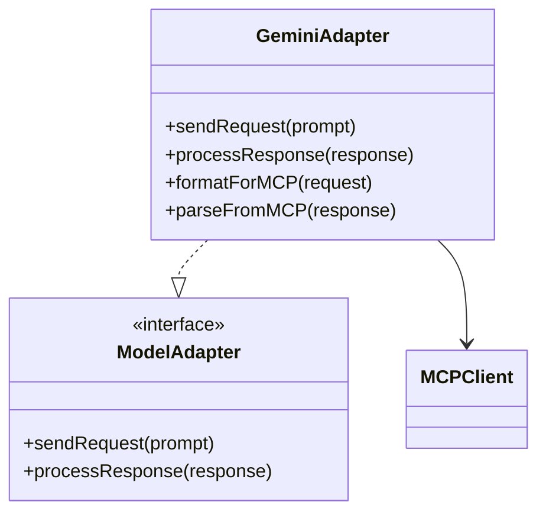
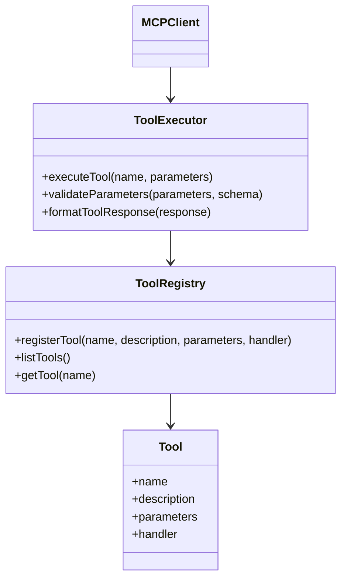
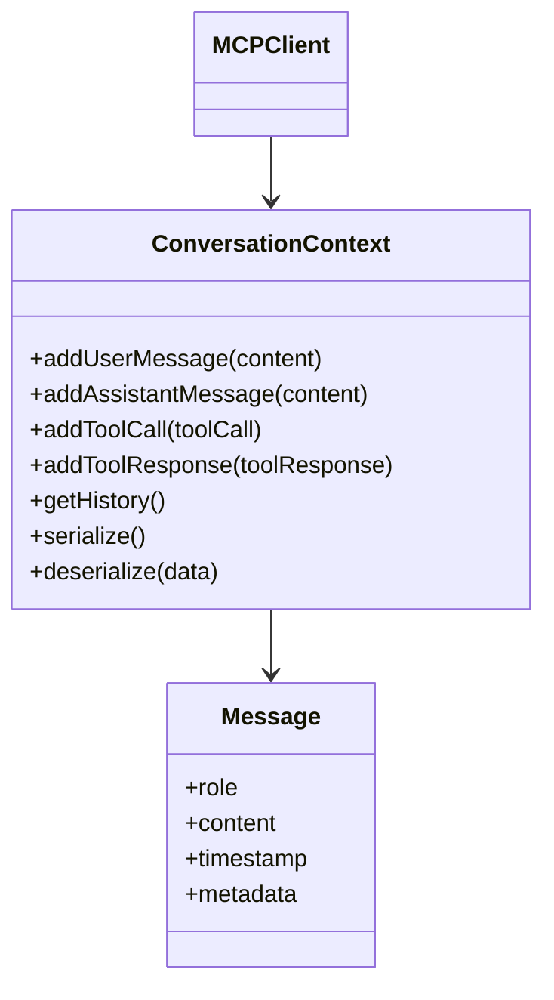
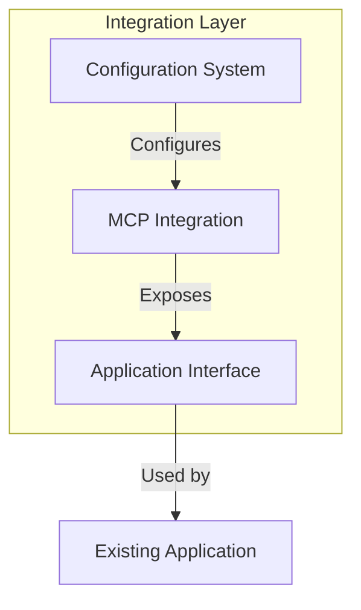

# MCP Integration Implementation Plan

This document outlines the plan for integrating MCP (Model Context Provider) protocol support into our CLI code, following design patterns from the [mcp-cli](https://github.com/chrishayuk/mcp-cli) project.

## System Design

### C4 Model Diagrams

#### Context Diagram

#### Container Diagram

#### Component Diagram

## Implementation Plan

### Step 1: Core MCP Protocol Client

**Objective**: Create a base client that implements the MCP protocol

**Tasks**:
- [x] Create basic MCP client class structure
- [x] Implement message formatting according to protocol
- [x] Add response parsing capabilities
- [x] Create configuration manager for MCP settings

**Tests**:
- [x] Test message format validation
- [x] Test response parsing
- [x] Test configuration loading
- [x] Mock server communication tests

**Status**: Completed

Implementation details:
- Created `MCPClient` class in `src/cli_code/mcp/client.py` with core protocol implementation
- Implemented `MCPMessage` and `MCPToolCall` classes for protocol message handling
- Added `MCPConfig` for client configuration
- Created `MCPConfigurationManager` in `src/cli_code/mcp/config.py` for server configuration
- Added comprehensive tests for all components

### Step 2: Gemini Model Adapter

**Objective**: Create adapter for Gemini model to use MCP protocol

**Tasks**:
- [ ] Create model adapter interface
- [ ] Implement Gemini-specific adapter
- [ ] Add MCP protocol formatting in the adapter
- [ ] Modify existing Gemini implementation to use the adapter

**Tests**:
- [ ] Test Gemini request formatting
- [ ] Test response parsing
- [ ] Test error handling
- [ ] Integration tests with mock MCP server

### Step 3: Tool Execution Framework

**Objective**: Implement framework for registering and executing tools

**Tasks**:
- [ ] Create tool registry for managing available tools
- [ ] Implement tool execution engine
- [ ] Add parameter validation based on JSON schema
- [ ] Create tool response formatter

**Tests**:
- [ ] Test tool registration
- [ ] Test parameter validation
- [ ] Test tool execution
- [ ] Test error handling during execution

### Step 4: Conversation Management

**Objective**: Create system for managing conversation history and context

**Tasks**:
- [ ] Create conversation context class
- [ ] Implement message history tracking
- [ ] Add serialization/deserialization for persistence
- [ ] Integrate with MCP client

**Tests**:
- [ ] Test adding messages to history
- [ ] Test conversation serialization/deserialization
- [ ] Test history retrieval with filters
- [ ] Test message metadata handling

### Step 5: Configuration and Integration

**Objective**: Create configuration system and integrate all components

**Tasks**:
- [ ] Create server configuration loader
- [ ] Implement environment variable support
- [ ] Add integration layer between your app and MCP components
- [ ] Update application entry points to support MCP

**Tests**:
- [ ] Test configuration loading from different sources
- [ ] Test integration with application code
- [ ] Test end-to-end flows with mock server
- [ ] Test error cases and recovery

### Step 6: Advanced Features and Optimization

**Objective**: Add advanced features and optimize performance

**Tasks**:
- [ ] Implement streaming responses
- [ ] Add conversation summarization
- [ ] Create tool suggestion mechanism
- [ ] Optimize message processing

**Tests**:
- [ ] Test streaming response handling
- [ ] Test summarization accuracy
- [ ] Test tool suggestion relevance
- [ ] Performance benchmarks

## Progress Tracking

| Step | Description | Status | Completion Date |
|------|-------------|--------|----------------|
| 1    | Core MCP Protocol Client | Completed | 2025-06-09 |
| 2    | Gemini Model Adapter | Not Started | - |
| 3    | Tool Execution Framework | Not Started | - |
| 4    | Conversation Management | Not Started | - |
| 5    | Configuration and Integration | Not Started | - |
| 6    | Advanced Features and Optimization | Not Started | - |

## References

- [mcp-cli GitHub Repository](https://github.com/chrishayuk/mcp-cli)
- [CHUK-MCP Protocol Library](https://github.com/chrishayuk/chuk-mcp) 