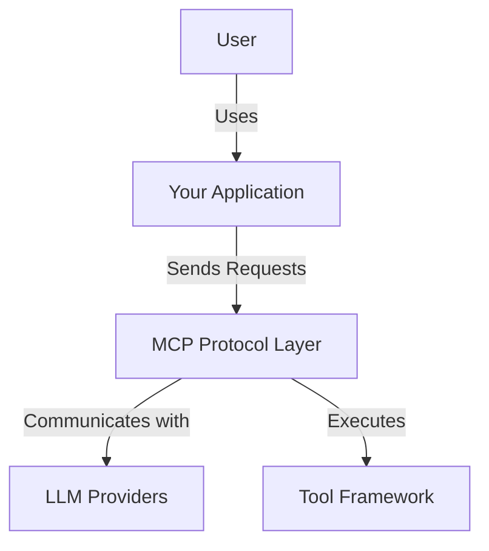
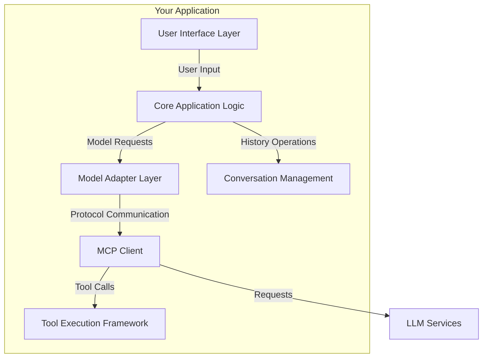
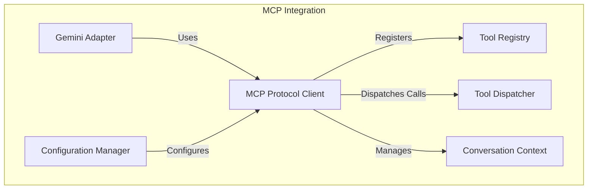
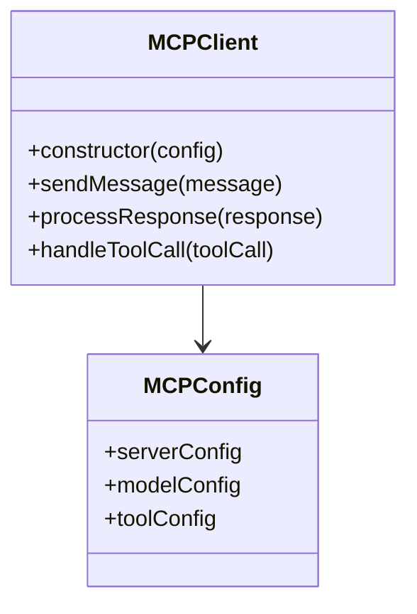
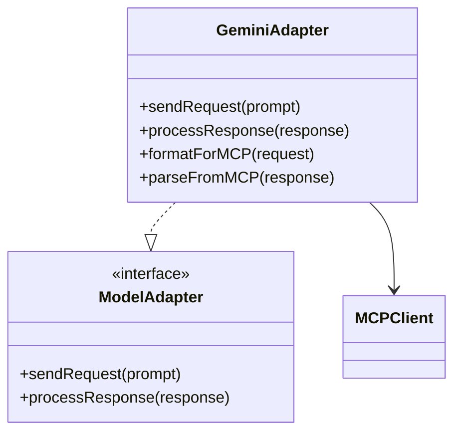
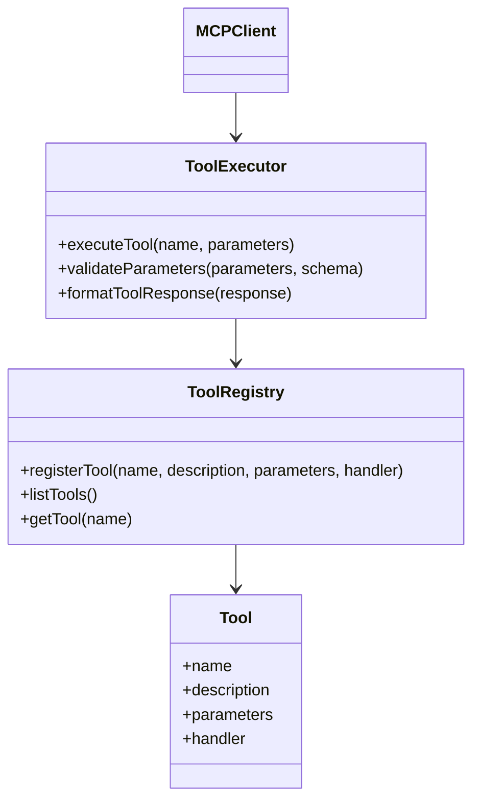
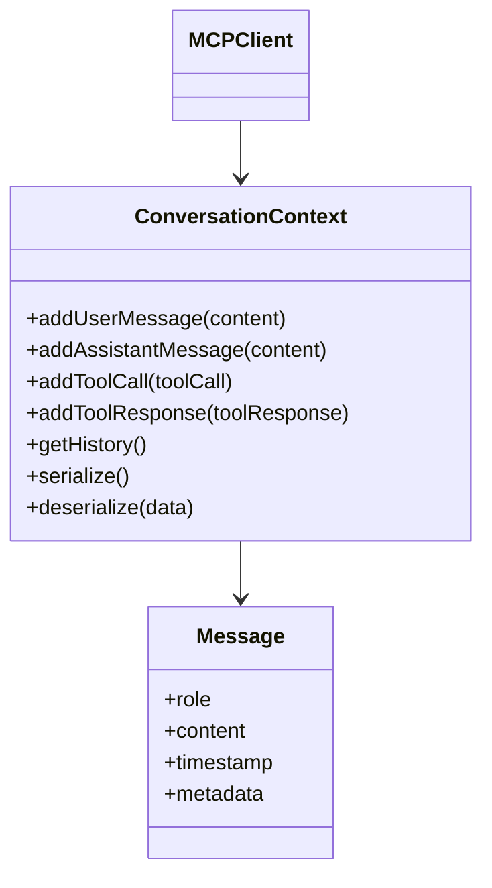
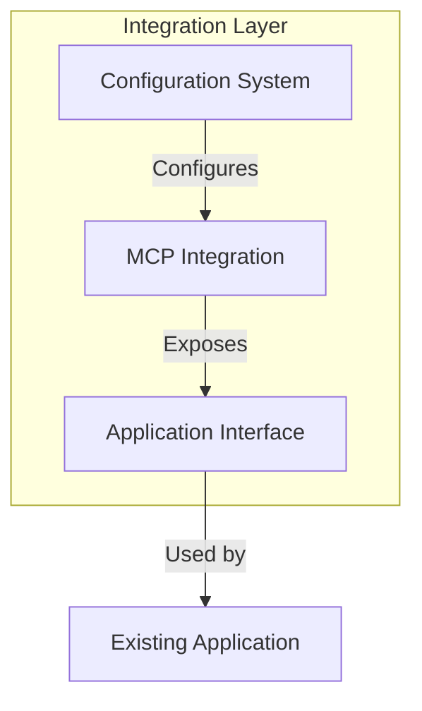

# MCP Integration Implementation Plan

This document outlines the plan for integrating MCP (Model Context Provider) protocol support into our CLI code, following design patterns from the [mcp-cli](https://github.com/chrishayuk/mcp-cli) project.

## System Design

### C4 Model Diagrams

#### Context Diagram


#### Container Diagram


#### Component Diagram


## Implementation Plan

### Step 1: Core MCP Protocol Client

**Objective**: Create a base client that implements the MCP protocol



**Tasks**:
- [x] Create basic MCP client class structure
- [x] Implement message formatting according to protocol
- [x] Add response parsing capabilities
- [x] Create configuration manager for MCP settings

**Tests**:
- [x] Test message format validation
- [x] Test response parsing
- [x] Test configuration loading
- [x] Mock server communication tests

**Status**: Completed

Implementation details:
- Created `MCPClient` class in `src/cli_code/mcp/client.py` with core protocol implementation
- Implemented `MCPMessage` and `MCPToolCall` classes for protocol message handling
- Added `MCPConfig` for client configuration
- Created `MCPConfigurationManager` in `src/cli_code/mcp/config.py` for server configuration
- Added comprehensive tests for all components

### Step 2: Gemini Model Adapter

**Objective**: Create adapter for Gemini model to use MCP protocol



**Tasks**:
- [x] Create model adapter interface
- [x] Implement Gemini-specific adapter
- [x] Add MCP protocol formatting in the adapter
- [x] Modify existing Gemini implementation to use the adapter

**Tests**:
- [x] Test Gemini request formatting
- [x] Test response parsing
- [x] Test error handling
- [x] Integration tests with mock MCP server

**Status**: Completed

Implementation details:
- Created `MCPModelAdapter` abstract class in `src/cli_code/mcp/model_adapter.py` as the adapter interface
- Implemented `GeminiModelAdapter` in `src/cli_code/mcp/adapters/gemini_adapter.py` for Gemini model
- Added message format conversion between Gemini and MCP formats
- Added tool execution support via the adapter
- Created `ModelAdapterFactory` for creating appropriate model adapters
- Added comprehensive tests for both the abstract adapter and Gemini implementation

### Step 3: Tool Execution Framework

**Objective**: Implement framework for registering and executing tools



**Tasks**:
- [x] Create tool registry for managing available tools
- [x] Implement tool execution engine
- [x] Add parameter validation based on JSON schema
- [x] Create tool response formatter

**Tests**:
- [x] Test tool registration
- [x] Test parameter validation
- [x] Test tool execution
- [x] Test error handling during execution

**Status**: Completed

Implementation details:
- Created `ToolRegistry` class in `src/cli_code/mcp/tools/registry.py` for managing tools
- Implemented `ToolExecutor` in `src/cli_code/mcp/tools/executor.py` for executing tools with validation
- Created `ToolResponseFormatter` in `src/cli_code/mcp/tools/formatter.py` for formatting results
- Added `Tool`, `ToolParameter`, and `ToolResult` classes in `src/cli_code/mcp/tools/models.py`
- Implemented `ToolService` in `src/cli_code/mcp/tools/service.py` as a high-level API
- Created example tools: Calculator and GitHub tools
- Added comprehensive tests for all components

### Step 4: Conversation Management

**Objective**: Create system for managing conversation history and context



**Tasks**:
- [ ] Create conversation context class
- [ ] Implement message history tracking
- [ ] Add serialization/deserialization for persistence
- [ ] Integrate with MCP client

**Tests**:
- [ ] Test adding messages to history
- [ ] Test conversation serialization/deserialization
- [ ] Test history retrieval with filters
- [ ] Test message metadata handling

### Step 5: Configuration and Integration

**Objective**: Create configuration system and integrate all components



**Tasks**:
- [ ] Create server configuration loader
- [ ] Implement environment variable support
- [ ] Add integration layer between your app and MCP components
- [ ] Update application entry points to support MCP

**Tests**:
- [ ] Test configuration loading from different sources
- [ ] Test integration with application code
- [ ] Test end-to-end flows with mock server
- [ ] Test error cases and recovery

### Step 6: Advanced Features and Optimization

**Objective**: Add advanced features and optimize performance

**Tasks**:
- [ ] Implement streaming responses
- [ ] Add conversation summarization
- [ ] Create tool suggestion mechanism
- [ ] Optimize message processing

**Tests**:
- [ ] Test streaming response handling
- [ ] Test summarization accuracy
- [ ] Test tool suggestion relevance
- [ ] Performance benchmarks

## Progress Tracking

| Step | Description | Status | Completion Date |
|------|-------------|--------|----------------|
| 1    | Core MCP Protocol Client | Completed | 2025-06-09 |
| 2    | Gemini Model Adapter | Completed | 2025-06-09 |
| 3    | Tool Execution Framework | Completed | 2025-06-15 |
| 4    | Conversation Management | Not Started | - |
| 5    | Configuration and Integration | Not Started | - |
| 6    | Advanced Features and Optimization | Not Started | - |

## References

- [mcp-cli GitHub Repository](https://github.com/chrishayuk/mcp-cli)
- [CHUK-MCP Protocol Library](https://github.com/chrishayuk/chuk-mcp)

# MCP Tool Execution Framework

This document provides an overview of the MCP (Model Context Provider) tool execution framework, which enables the integration of tools with AI models through the MCP protocol.

## Overview

The MCP tool execution framework provides a standardized way to define, register, execute, and interact with tools. It includes several components:

- **Tool Models**: Classes representing tools, their parameters, and execution results.
- **Tool Registry**: A registry for managing tool registrations.
- **Tool Executor**: A component for executing tools with parameter validation.
- **Tool Formatter**: A component for formatting tool execution results.
- **Tool Service**: A high-level API for executing tools.
- **MCP Integration**: Components for integrating the tool framework with the MCP protocol.

## Architecture

The framework is designed with a clean separation of concerns:

```
┌───────────────┐     ┌───────────────┐     ┌───────────────┐
│   MCP Client  │◄────┤MCP Integration│◄────┤ Tool Service  │
└───────────────┘     └───────────────┘     └───────────────┘
                                                   ▲
                                                   │
                                      ┌────────────┴────────────┐
                                      │                         │
                                ┌──────────┐             ┌──────────┐
                                │  Executor │             │ Formatter│
                                └──────────┘             └──────────┘
                                      ▲
                                      │
                                ┌──────────┐
                                │ Registry │
                                └──────────┘
                                      ▲
                                      │
                                ┌──────────┐
                                │   Tools  │
                                └──────────┘
```

## Components

### Tool Models

The `Tool` class represents a tool that can be executed. Each tool has:
- A name and description
- A list of parameters
- A handler function
- A JSON schema for parameter validation

The `ToolParameter` class defines a parameter for a tool, including:
- Name and description
- Type
- Whether it's required
- Default value
- Allowed values (enum)

The `ToolResult` class represents the result of a tool execution, including:
- Success/failure status
- Result data
- Error message (if any)

### Tool Registry

The `ToolRegistry` class manages tool registrations and provides methods to:
- Register and unregister tools
- Get a tool by name
- List all registered tools
- Get schemas for all tools

### Tool Executor

The `ToolExecutor` class executes tools with parameter validation:
- Validates parameters against the tool's schema
- Executes the tool with the validated parameters
- Returns a `ToolResult` object

### Tool Formatter

The `ToolResponseFormatter` class formats tool execution results:
- Formats a single result
- Formats multiple results
- Formats errors

### Tool Service

The `ToolService` class provides a high-level API for executing tools:
- Executes a single tool and formats the result
- Executes multiple tools and formats the results
- Gets information about available tools

### MCP Integration

The `MCPToolIntegration` class integrates the tool framework with the MCP protocol:
- Handles tool calls from the MCP protocol
- Processes assistant messages with tool calls
- Gets tool definitions for the MCP protocol
- Executes a full conversation turn with the MCP protocol

## Creating a Tool

To create a tool, you need to:

1. Define a handler function
2. Create a `Tool` instance with the handler
3. Register the tool with the `ToolRegistry`

Here's an example of a calculator tool:

```python
from cli_code.mcp.tools.models import Tool, ToolParameter

async def calculator_handler(operation: str, a: float, b: float):
    if operation == "add":
        result = a + b
    elif operation == "subtract":
        result = a - b
    elif operation == "multiply":
        result = a * b
    elif operation == "divide":
        if b == 0:
            raise ValueError("Division by zero is not allowed")
        result = a / b
    else:
        raise ValueError(f"Unsupported operation: {operation}")

    return {
        "operation": operation,
        "a": a,
        "b": b,
        "result": result
    }

calculator_tool = Tool(
    name="calculator",
    description="Performs basic arithmetic operations",
    parameters=[
        ToolParameter(
            name="operation",
            description="The operation to perform",
            type="string",
            required=True,
            enum=["add", "subtract", "multiply", "divide"]
        ),
        ToolParameter(
            name="a",
            description="The first operand",
            type="number",
            required=True
        ),
        ToolParameter(
            name="b",
            description="The second operand",
            type="number",
            required=True
        )
    ],
    handler=calculator_handler
)

# Register the tool
registry = ToolRegistry()
registry.register(calculator_tool)
```

## Executing a Tool

To execute a tool:

```python
import asyncio
from cli_code.mcp.tools.service import ToolService

# Set up the tool service
service = ToolService(registry)

# Execute the tool
parameters = {
    "operation": "add",
    "a": 1,
    "b": 2
}
result = await service.execute_tool("calculator", parameters)
print(result)
```

## CLI Usage

The framework includes a CLI for interacting with tools:

```
# Run in interactive mode
python -m cli_code.mcp.cli interactive

# Run a specific tool
python -m cli_code.mcp.cli run calculator --parameters '{"operation": "add", "a": 1, "b": 2}'

# List available tools
python -m cli_code.mcp.cli list
```

## Environment Variables

The framework uses the following environment variables:

- `MCP_API_KEY`: API key for MCP server authentication
- `MCP_ENDPOINT`: URL of the MCP server
- `MCP_MODEL`: Model to use for requests

## Example Script

See the example script at `examples/mcp_calculator_example.py` for a complete working example.

## Best Practices

1. **Async Handlers**: Tool handlers should be async to support long-running operations.
2. **Error Handling**: Handle errors appropriately in tool handlers and return meaningful error messages.
3. **Parameter Validation**: Define parameter schemas carefully to ensure proper validation.
4. **Result Format**: Return structured results for better presentation.

## Further Reading

- [MCP Protocol Documentation](https://example.com/mcp-protocol)
- [Tool Development Guide](https://example.com/tool-development)
- [API Reference](https://example.com/api-reference)
