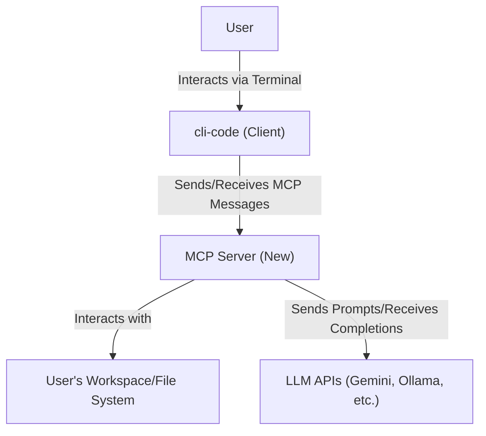
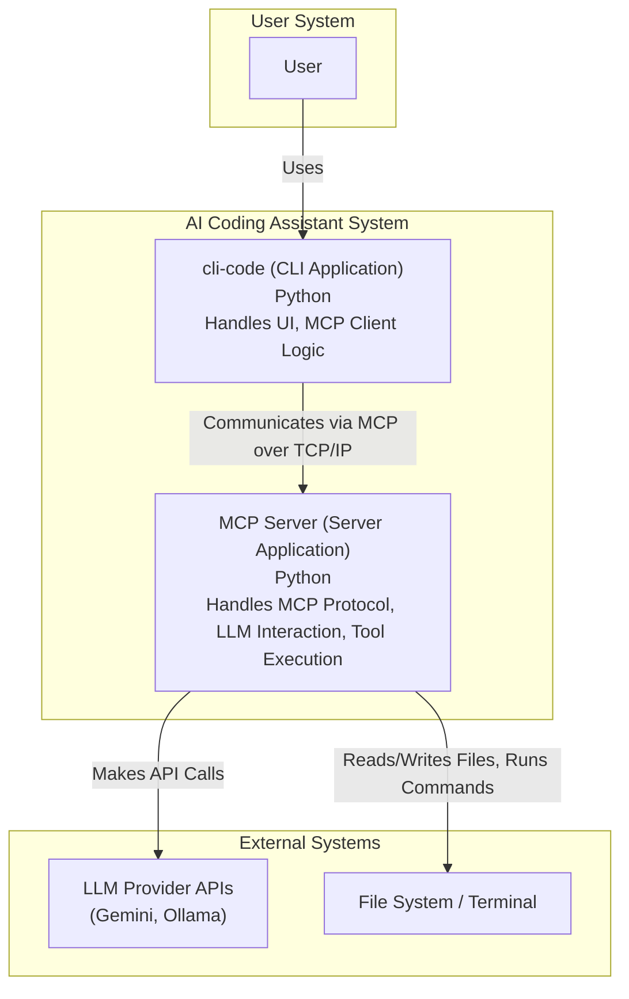
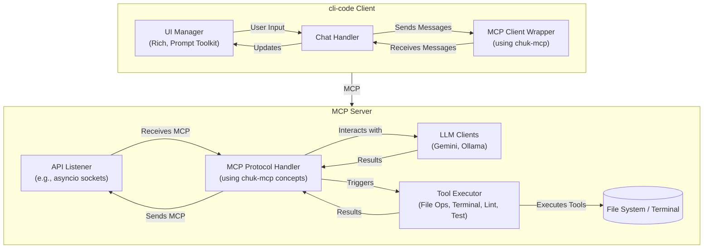
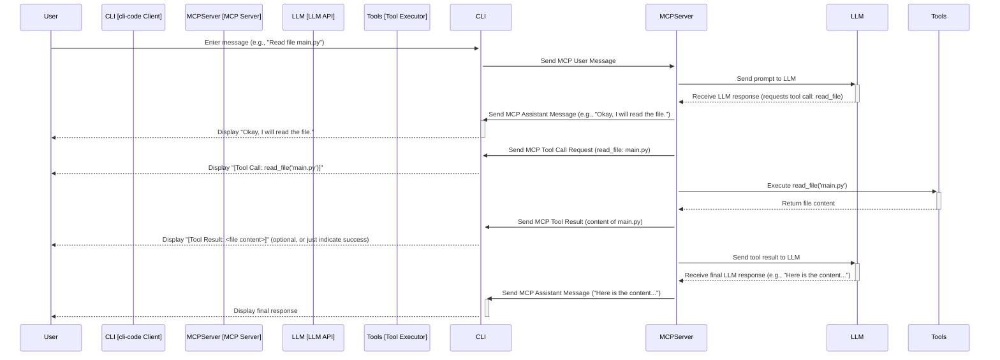

# MCP Integration Plan for cli-code

This document outlines the plan to refactor `cli-code` from direct LLM API integration to using the Model Context Provider (MCP) protocol. This involves transforming `cli-code` into an MCP client and creating a dedicated MCP server to handle LLM communication and tool execution, while retaining the focus as a specialized AI coding assistant.

## 1. Architecture Overview (C4 Model)

We will adopt a client-server architecture. `cli-code` acts as the client, providing the user interface, while a new `MCP Server` handles backend logic.

### Level 1: System Context



*   **User:** The developer using the terminal.
*   **cli-code (Client):** The existing CLI application, refactored to be an MCP client. Responsible for UI, sending user input, and displaying server responses (including text and tool activity).
*   **MCP Server (New):** A new server application responsible for MCP protocol handling, LLM interaction, and executing coding-specific tools against the user's workspace.
*   **User's Workspace/File System:** Where the code resides and where tools like file operations and terminal commands are executed by the server.
*   **LLM APIs:** External services like Google Gemini or local Ollama instances that provide the language model capabilities.

### Level 2: Containers



*   **cli-code (CLI Application):** The Python application running in the user's terminal. Contains UI logic and an MCP client component (`chuk-mcp`).
*   **MCP Server (Server Application):** A separate Python process. Contains MCP protocol handling logic, LLM client implementations (Gemini, Ollama), and the tool execution engine.

### Level 3: Components (Conceptual)



## 2. Interaction Flow (Sequence Diagram)



## 3. Roadmap & Milestones

This roadmap breaks the implementation into manageable milestones. Each milestone will be developed on a separate feature branch, ensuring adherence to development practices before merging into `main`.

*   **M1: Setup & Basic Client Connection** (`feature/mcp-client-setup`)
    *   Add `chuk-mcp` dependency to `cli-code`.
    *   Create a *stub* MCP server (minimal listener, echoes messages).
    *   Refactor `cli-code`'s main chat loop to connect to the stub server using `chuk-mcp`.
    *   Implement basic sending of user messages and receiving/displaying text responses via MCP.
    *   Ensure tests pass (>80% coverage) and linters are clean.

*   **M2: Basic Server Implementation** (`feature/mcp-server-basic`)
    *   Develop a functional MCP server application skeleton.
    *   Implement MCP protocol handling on the server.
    *   Integrate one LLM provider (e.g., Gemini) into the server.
    *   Server proxies simple text messages between `cli-code` and the LLM.
    *   Configure server connection details (e.g., host/port) possibly via env vars initially.
    *   Ensure server tests pass (>80% coverage) and linters are clean.

*   **M3: Tool Interaction Display (Client)** (`feature/mcp-client-tool-display`)
    *   Modify `cli-code` UI to correctly parse and display MCP messages related to tool calls (Tool Call Request, Tool Result) originating from the server.
    *   No tool *execution* logic in the client.
    *   Update client tests.

*   **M4: Server-Side Core Tool Execution** (`feature/mcp-server-core-tools`)
    *   Implement execution logic for core file system tools (`read_file`, `edit_file`, `list_dir`, `file_search`, `grep_search`) within the `MCP Server`.
    *   Server receives tool call requests from LLM, executes them, and sends results back.
    *   *Remove* the corresponding tool execution logic from `cli-code`.
    *   Add server tests for tool execution. Update client tests.

*   **M5: Server-Side Advanced Tool Execution** (`feature/mcp-server-advanced-tools`)
    *   Implement execution logic for advanced tools (`run_terminal_cmd`, linting, testing) on the `MCP Server`.
    *   **Crucially:** Implement security measures (sandboxing, path validation) for `run_terminal_cmd`.
    *   *Remove* the corresponding tool execution logic from `cli-code`.
    *   Add server tests for these tools. Update client tests.

*   **M6: Configuration & Multi-Provider Support** (`feature/mcp-config-multiprovider`)
    *   Refine configuration handling in `cli-code` to specify the MCP server address (`config.yaml`, env vars).
    *   Implement logic (likely server-side) to manage and select between multiple LLM providers (Gemini, Ollama) based on configuration or client request.
    *   Update configuration documentation (`docs/install.md`).
    *   Update tests.

*   **M7: Deployment & Packaging** (`feature/mcp-deployment`)
    *   Decide on the server deployment strategy (e.g., run as a background process started by `cli-code`, separate installation, containerization).
    *   Update `pyproject.toml` and packaging scripts (`setup.py` or equivalent) if the server needs to be bundled or installed alongside the client.
    *   Update installation and usage documentation (`README.md`, `docs/install.md`).

*   **M8: Refinement & Final Documentation** (`feature/mcp-refinement`)
    *   Conduct end-to-end testing.
    *   Perform code cleanup and final refactoring based on testing.
    *   Ensure all documentation is up-to-date with the new architecture.
    *   Final check of test coverage and linter compliance.

## 4. Development Practices

For *each* milestone:

1.  **Feature Branch:** All work will be done on a dedicated feature branch (e.g., `feature/mcp-client-setup`).
2.  **Small Commits:** Use small, logical commits with clear messages.
3.  **Code Coverage:** Maintain >80% unit test coverage for all *new* and *modified* code in both `cli-code` and the new `MCP Server` application. Coverage checks must pass in CI.
4.  **Linting:** All code must pass configured linter checks (e.g., Ruff, MyPy) in CI.
5.  **Pull Request:** Submit a Pull Request to `main` upon completion of the milestone.
6.  **CI Pipeline:** The PR must pass all checks in the CI pipeline (tests, linting, coverage) before merging.

## 5. Additional Considerations

*   **Security:** This is paramount, especially for the `run_terminal_cmd` tool. The MCP server *must* be designed with security in mind.
    *   **Sandboxing:** Explore using containers or restricted shells for executing terminal commands.
    *   **Path Validation:** Ensure file operations are strictly limited to the intended project workspace. Validate paths thoroughly.
    *   **Input Sanitization:** Sanitize arguments passed to tools.
    *   **Permissions:** Run the server process with the least privilege necessary.
*   **Server Deployment:** How will users run the MCP Server?
    *   **Option A (Bundled):** `cli-code` starts/manages the server process in the background. Simplest for users, but couples the client and server lifecycles.
    *   **Option B (Separate):** Users install and run the server separately. More flexible, allows independent updates, but adds a step for the user.
    *   **Option C (Hosted):** A remote server (less likely for this use case due to local file access needs).
    *   *Recommendation:* Start with Option A or B (local process).
*   **Error Handling:** Implement robust error handling for network issues between client/server, LLM API errors, and tool execution failures. Propagate errors meaningfully back to the user via MCP messages.
*   **Configuration:** How will the server know which workspace context to operate in? This likely needs to be passed during connection setup from `cli-code` or configured separately for the server.
*   **State Management:** Consider if any state needs to be shared or synchronized between the client and server beyond standard MCP messages.
*   **Dependency (`chuk-mcp`):** Ensure compatibility and understand the maintenance status of the chosen MCP library.
*   **Future Protocol Implementation:** While using `chuk-mcp` initially accelerates development, consider potentially developing an in-house MCP protocol handler in the future. This could offer more control and faster adaptation if the MCP standard evolves significantly or if `chuk-mcp` development lags behind desired features.
*   **Performance:** Monitor for any noticeable latency introduced by the client-server hop, although it's expected to be minor for this use case.
``` 